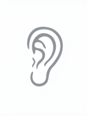
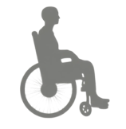
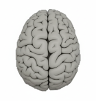

<!--
author:              CivicActions Accessibility Team
email:               accessibility@civicactions.com
language:            en
comment:             This CivicActions internal training course is updated and maintained by CivicActions.
controlled_document: AC7042 Accessibility Foundations
-->

# Accessibility Training
?[axwelcome.webm](assets/axwelcome.webm)

Welcome to the Accessibility training. In this module, we'll provide the foundational knowledge you need to champion accessibility on your projects. This training is key for the awareness of everyone across the company and provides the context for us to understand and embrace this initiative.

## Accessibility at CivicActions
?[axatCA.webm](assets/axatCA.webm)

At CivicActions, our mission is to build better public services. A core part of that mission is ensuring that everything we create, from websites to internal tools, is fully accessible. It's not just about compliance; it's about building inclusion from the very start.

## Agenda
?[axagenda.webm](assets/axagenda.webm)

Throughout this course, we'll cover
- What accessibility is
- Why it's important to CivicActions
- Our accessibility roles and responsibilities
- Accessibility as part of our quality objectives
- How you can be an accessibility champion

## Accessibility Defined
?[axdefined.webm](assets/axdefined.webm)

What do we mean by accessibility in the digital world? Accessibility is an ongoing process to ensure that all users, especially those with disabilities, have equal access to the website content we create. This work requires commitment at every stage: from the initial planning and design phases to the final engineering and deployment. It's a fundamental part of quality and inclusivity. 

## Benefits
?[axbenefits.webm](assets/axbenefits.webm)

When we focus on digital products like websites, content management, and procedures, everyone benefits. But let's look closer at how disability impacts the use of technology:

?[aximpairments.webm](assets/aximpairments.webm)

|  | Disability type | Technology use |
| :-----: | :---------- | :--------------------------------------- |
|  | Hearing impairments | Deaf and hard of hearing people need **captioned videos** and **audio transcripts**. Ambient sounds should be included in transcripts when they convey context or meaning. |
|  | Motor impairments | People with mobility issues or injury may navigate with **keyboard**, **stylus**, **large touch input**, **eye-tracker**, or **voice control**. |
|  | Cognitive impairments | Peope with cognitive issues may require **custom fonts** or **tools**, or **control over animations** and **movements**. **Plain language** and **contextual help** improve guidance. |
|  | Visual impairments | Blind, low-vision, and color-blind people may use **screen readers** or **magnifiers**, adjust **browser zoom settings**, or **customize colors** or **contrast levels**.

?[axtemporary.webm](assets/axtemporary.webm)

It's also crucial to remember that disability isn't always permanent. An injury might cause a **temporary** motor disability. Being stressed or exhausted might create a **situational** cognitive difficulty. **Environmental** factors matter, too. Things like distractions nearby, current mental health, slow internet speed, or oudated services can all influence how someone sees, hears, moves, or concentrates on the content. Our work must account for the full range of human experience, which includes permanent, temporary, situational, and environmental barriers. 

## Assistive technology
?[axassistive.webm](assets/axassistive.webm)

Assistive technology is the hardware and software people use to interact with the digital world. Examples include screen readers for the visually impaired, voice recognition software for motor disabilities, and text-to-speech for cognitive issues. These tools are essential aids for communication and interaction.

?[axatbenefits.webm](assets/axatbenefits.webm)

Let's take a look at some assistive technology examples:

| Users who have | May benefit from |
| :---------- | :--------------------------------------- |
| Hearing impairments | <ul><li>Amplified telephones</li><li>Alert systems with lights</li><li>Auto-captioning</li></ul> |
| Motor impairments | <ul><li>Eye-tracking technology</li><li>Voice recognition devices/software</li><li>Siri</li></ul> |
| Cognitive impairments | <ul><li>List Text to speech</li><li>Noise canceling headphones</li><li>Screen reader in "reader" mode</li></ul> |
| Visual impairments | <ul><li>Screen readers</li><li>Screen magnifiers/browser zoom</li><li>Eyeglasses</li></ul> |

### Inaccessible content
?[axinaccessibility.webm](assets/axinaccessibility.webm)

When content is inaccessible, assistive technology doesn't function as intended. Barriers we design or build into a website cannot be overcome with assistive technology.

**Sound inaccessibility**
- Audio content without captioning
- Media player with no volume controls
- Auto-played videos with no way to pause or stop

**Interactions inaccessibility**
- Interface only accepts mouse clicks
- Touch targets are too small
- Text is "baked" into images

**Content inaccessibility**
- Complex, run-on sentences
- Navigation is inconsistent
- No instructions provided

**Visual inaccessibility**
- Color alone indicates a change in value
- Charts and graphs are missing text equivalents
- Required fields indicated only with an asterisk

## Checkpoint quiz
?[quizstart.webm](assets/quizstart.webm)

Let's take a moment to review what we've covered so far. Select the correct answer or answers for the next few questions.

### What is accessibility?
- [( )] A fairly new initiative mandated by CivicActions
- [(X)] An ongoing process to ensure all users have equal access to the digital content we create
- [( )] A visual design method
- [( )] A step-by-step content creation process

### Which of the following is an assistive technology? Select all that apply
- [[X]] Siri
- [[ ]] Media player with no volume controls
- [[x]] Screen readers
- [[ ]] Audio content without captioning
- [[X]] Auto-captioning
- [[X]] Noise-cancelling headphones
- [[X]] Browser zoom
- [[X]] Text to speech

### Disabilities can be...? Select all that apply
- [[X]] Permanent
- [[X]] Temporary
- [[X]] Situational
- [[X]] Environmental

## Accessible Roles and Responsibilities Mapping
?[ARRM.webm](assets/ARRM.webm)

To manage the complexity of web accessibility, we use the W3C's **Accessible Roles and Responsibilities Mapping (ARRM)**. ARRM is an initiative to break down accessibility work by digital role, aligning with the international standard: the **Web Content Accessibility Guidelines (WCAG)**. WCAG 2.2 currently has 86 success criteria. 

ARRM helps us answer:
- Which criteria apply to specific roles
- Who's responsible for what?

### ARRM and RACI
?[axRACI.webm](assets/axRACI.webm)

ARRM is designed to emulate a **Responsible, Accountable, Consulted, and Informed (RACI)** matrix. The goal is to embed accessibility into the definition of every digital role to catch issues earlier. For example, finding a color contrast issue is more costly if it's discovered late rather than in the design phase. ARRM uses primary, secondary, and contributor roles to help teams address complex, multi-role issues. 

## Tasks and roles
?[axtasks.webm](assets/axtasks.webm)

ARRM breaks down WCAG criteria into smaller, role-specific tasks. This task-based system allows different roles to consider their  specific WCAG responsibilities, moving beyond the simple WCAG success criteria numbers. 

### Content design (Author role)
?[axcontent.webm](assets/axcontent.webm)

Content authors are responsible for providing text alternatives for images. Other key duties include:
- Using meaningful page titles and headings
- Ensuring meaningful link text
- Providing transcripts and captions for audio and video content
- Using plain language and everyday words

### Visual design (Design role 1)
?[axvisual.webm](assets/axvisual.webm)

Visual designers must be mindful of the intentional use of color and its limitations. Other key duties include:
- Avoiding images that contain text
- Supporting keyboard focus and navigation
- Creating consistent configuration workflows
- Ensuring consistency in the use of objects and calls to action

### Human-centered design (Design role 2)
?[axHCD.webm](assets/axHCD.webm)

HCD roles, including UX and UX research, focus on user interactions. Other key duties include:
- Ensuring that hover and focus actions move as expected
- Providing a logical and predictable way-finding
- Building forms that provide persistent labels, helpful errors, and useful cues
- Giving users control over any triggered elements

### Frontend/Backend engineering (Dev roles)
?[axfrontend.webm](assets/axfrontend.webm)

Developers are responsible for the technical foundation. Other key duties include:
- Ensuring pages use semantic HTML and aria labels
- Including keyboard-only accessibility
- Coding skip links and dynamic messages to be programmatically conveyed
- Using proper CSS techniques to ensure content displays properly regardless of screen magnification

## Checkpoint quiz
?[quizstart.webm](assets/quizstart.webm)

Let's take a moment to review what we've covered so far. Select the correct answer or answers for the next few questions.

### Which of the following is not typically one of the roles listed in Accessibility Roles and Responsibilities Mapping (ARRM)?
- [( )] Frontend developer
- [( )] Content designer
- [( )] Visual designer
- [(X)] Database administrator

### Which statement is true according to ARRM?
- [( )] Developers should own every accessibility requirement because they implement it
- [( )] All roles must have primary ownership of every accessibility task
- [(X)] Ownership should be assigned based on which role made the decision, not just who implemented it
- [( )] Secondary and contributor levels are optional, so you can always skip them

### Which design role focuses on hover/focus behavior, wayfinding, and error feedback in forms?
- [(X)] Human-centered designer (UX/UX Researcher)
- [( )] Visual designer
- [( )] Contributor
- [( )] QA tester
  
### What is the main purpose of the ARRM?
- [( )] To create new WCAG success criteria
- [(X)] To break down accessibility responsibilities by common digital roles
- [( )] To replace Section 508 testing
- [( )] To provide color-contrast tools

## Accessibility Quality Objectives
?[axQMS.webm](assets/axQMS.webm)

As part of our ISO 9001 certification and Quality Management System (QMS) implementation, accessibility is a key quality objective in our practice area. We monitor our competency and investment in this area by tracking:

- Annual team-wide training
- Role-based training and certification
- Opportunities for continuous improvement
- Engagement in accessibility communities through feedback, social media posts, and speaking opportunities

## Get Involved
?[axinvolved.webm](assets/axinvolved.webm)

There are several ways to get involved in our accessibility practice area:

- Pursue EdX and IAAP certifications
- Attend our monthly accessibility practice area meetings
- Join the active #accessibility Slack channel
- Contribute to our accessibility site: https://accessibility.civicactions.com

## Summary
?[axsummary.webm](assets/axsummary.webm)

As we close out this training, please remember that we all have a responsibility to design, build, and ensure accessible content for all. Take some time to jot down a few ways you can start today as an accessibility champion. Thank you for playing your part in helping CivicActions deliver on our commitment to accessible digital content for all. 
