<!--
author:              CivicActions Internal Compliance Team
language:            en
comment:             This CivicActions internal training course is updated and maintained by CivicActions.
controlled_document: CP7052 ISO 9001 Training
-->

# Quality Management System Training
?[Welcome.webm](assets/Welcome.webm)

Welcome to the Quality Management System training. In this module, we'll cover the ISO 9001 overview and what it means for us here at CivicActions. This training is key for the awareness of everyone across the company. This training provides the context for us to understand and embrace this initiative.

## Overview
?[Overview.webm](assets/Overview.webm)

- Quality Management System
- Why we need it
- Quality policy and objectives
- Implementation status
- Audit preparation
- Expectations and next steps

## The importance of ISO 9001 and QMS 
?[Importance.webm](assets/Importance.webm)

Quality isn't just about being lucky, and ISO 9001 isn't just about certification. It's about growing with intent, planning, learning, and readjusting along the way. The phrase that captures the spirit of this effort is: 

>"This is how we do good work, consistently."

Quality establishes repeatable excellence, and the ISO 9001 helps us achieve this repeatable excellence. Let's talk more about what it is and what it means for us at CivicActions.

### ISO 9001 explained
?[ISO.webm](assets/ISO.webm)

| What it is |                                       
|:---------------|
| Industry standard |
| Focuses on outcomes |
| Flexible |

| What it isn't |
|---------------:|
| Prescriptive checklist |
| Extra work |

### Quality Management System explained
?[QMS.webm](assets/QMS.webm)

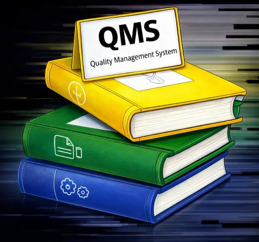

The Quality Management System, or QMS, is a collection of policies, procedures, feedback loops, and metrics. All of this information is housed in our CivicActions Confluence CMS space. It connects our existing key processes with a few new ones. Most importantly, it applies to everyone at CivicActions, not just our delivery team. 

### How does it work?
?[Howitworks.webm](assets/Howitworks.webm)

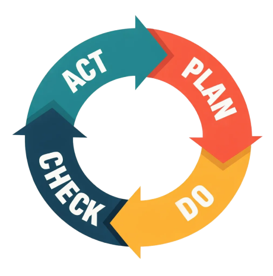

> The QMS operates on the Continual Improvement Cycle, often referred to as the PDCA (Plan-Do-Check-Act). We **plan**<!-- style="color: red" --> by looking for opportunities to improve. We **do**<!-- style="color: orange" --> by implementing those improvements. We **check**<!-- style="color: indigo" --> by measuring the results, and we **act**<!-- style="color: green" --> by standardizing the change and restarting the cycle. These processes help us monitor and continuously improve our service delivery to ensure consistent client results, regulatory compliance, and operational efficiency.

### Why this matters
?[whynow.webm](assets/whynow.webm)

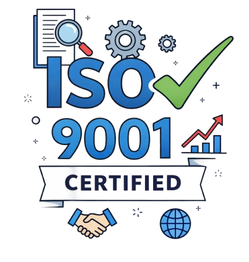

Implemented in 2026, this was part of our "Glow-up 2026" campaign; an effort to signal our maturity in professional services. By putting these intentional structures in place, we build our reputation, create scalable processes that grow with us, and formalize our commitment to continual improvement. 

## Checkpoint quiz
?[quizstart.webm](assets/quizstart-d7c1e995.webm)

Let's take a moment to review what we've covered so far. Select the correct answer or answers for the next few questions.

### What is ISO 9001?
- [( )] A prescriptive checklist that cannot be changed
- [(X)] A framework for consistent quality delivery
- [( )] Work we must do so we can say we've done it
- [( )] A rigid framework that focuses on processes over outcomes

### 2. What is a Quality Management System?
- [( )] A guideline on how to define quality
- [( )] A framework for consistent quality delivery
- [(X)] A collection of policies, procedures, feedback loops, and metrics
- [( )] A framework that applies only to our delivery team

### 3. The QMS operates on the Continual Improvement Cycle, which comprises four steps. What are the four steps? (select all that apply)
\* hint, think PDCA
- [[ ]] Activate
- [[X]] Do
- [[X]] Check
- [[ ]] Prioritize
- [[X]] Plan
- [[ ]] Consistency
- [[X]] Act

### 4. Where can you find the CivicActions QMS?
- [( )] Github
- [( )] Jira
- [( )] Google Drive
- [(X)] Confluence

## CivicActions Quality Policy
?[CAPolicy.webm](assets/CAPolicy.webm)

>> CivicActions **partners**<!-- style="color: purple" --> with government agencies to make a **positive impact**<!-- style="color: orange" --> by creating human-centered services that are **accessible to everyone**<!-- style="color: red" -->. CivicActions' commitment to quality means not only meeting customer expectations and complying with all necessary requirements, but also exceeding quality expectations through **company culture**<!-- style="color: blue" -->, **continual improvement**<!-- style="color: indigo" -->, and **free and open technologies**<!-- style="color: green" -->.

### What the policy means in practice
?[Policypractice.webm](assets/Policypractice.webm)

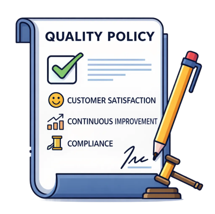

In practice, the policy drives our measurable goals, guides our key processes, and helps us identify areas for growth. Most importantly, it builds a culture of quality that aligns with our core values and guides every decision we make.

## CivicActions Quality Objectives
?[Objectives.webm](assets/Objectives.webm)

Our quality objectives focus on seven key areas: 
- Partnering
- Positive Impact
- Human-Centered Design
- Accessible to Everyone
- Company Culture
- Free and Open Technologies
- Continual Improvement. 

### Partnering
?[Partnering.webm](assets/Partnering.webm)

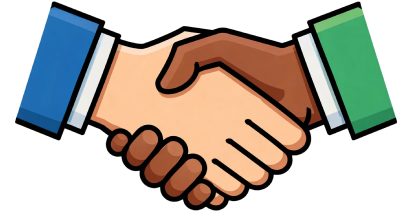

Starting with partnering, our objective is to intentionally assess the alignment of all our partners. We want to work with those who share our values and quality expectations. This is done through our new Key Process, the Partner Criteria. This criteria will measure the assessment of new partners, completion of annual reviews, and tracking partner ratings.

### Positive impact
?[Positiveimpact.webm](assets/Positiveimpact.webm)

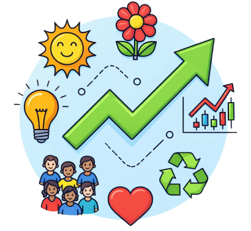

To achieve a positive impact, we track outcomes across the entire project life cycle to ensure our work meaningfully improves public outcomes. We apply Impact Criteria to new opportunities, tracking impact at key milestones, and including impact reflection in all retrospectives.

### Human-centered design
?[HCD.webm](assets/HCD.webm)

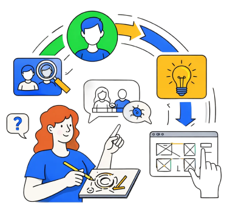

Our objective for human-centered design is to maintain best practices to build services centered on real user needs. This is supported by Competency and training. We measure this through HCD training completion rates and tracking HCD practices in our delivery work. 

### Accessible to everyone
?[accessibility.webm](assets/accessibility.webm)

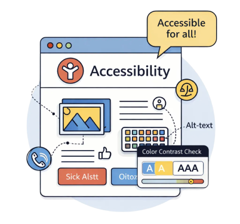

Similarly, we aim to continually improve our accessibility practice to build inclusive services by default. This is also supported by Competency and training. Our measures include accessibility training completion and continuous improvement against industry standards.

### Company culture
?[Culture.webm](assets/Culture.webm)

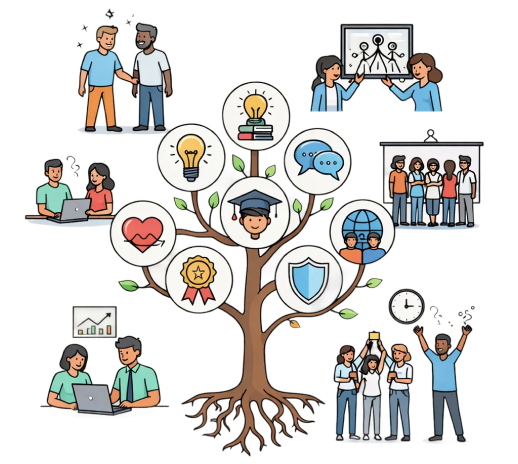

Our strongest resource is our people power. Our company culture is defined by openness, balance, and care. Having a pulse on how we feel is important to delivering quality service. This is supported by our engagement survey. We'll measure participation, analyze trends, and track action items from your feedback. 

### Free and open technologies
?[Freetech.webm](assets/Freetech.webm)

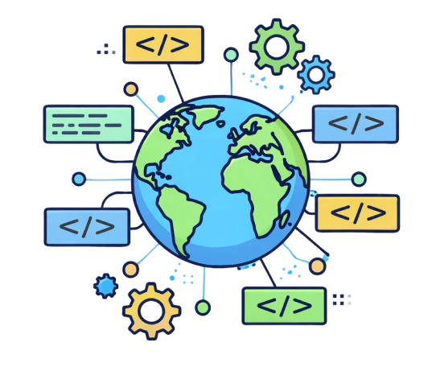

Our focus on free and open technologies is part of our secret sauce for delivering sustainable, open solutions. For our QMS, we'll monitor our contributions to the community and license tracking.

### Continual improvement
?[continualimprovement.webm](assets/continualimprovement.webm)

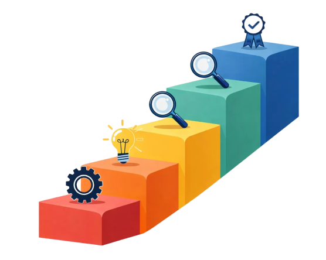

Continual improvement is a core requirement of ISO 9001. Our intent is to learn and improve intentionally. In our service delivery, we'll continue to improve how we manage client requirements, handle our projects, address feedback, and ensure we capture feedback via project retros to feed the continual improvement cycle. 

## Checkpoint quiz
?[quizstart.webm](assets/quizstart-d7c1e995.webm)

Let's take a moment to review what we've covered so far. Select the correct answer or answers for the next few questions.

### 5. Which of these objectives is a new process coming out of our QMS activities?
- [(X)] Partner criteria
- [( )] Impact criteria
- [( )] FOSS
- [( )] Human-centered design

### 6. Which of the following are quality objectives?  
Select all that apply
- [[X]] Partnering
- [[X]] Human-centered design
- [[ ]] Practice area
- [[X]] Accessible to everyone
- [[X]] Continual improvement
- [[X]] Positive impact
- [[ ]] Negative impact
- [[X]] Company culture
- [[X]] Free and open technologies

## What's next
?[audit.webm](assets/audit.webm)

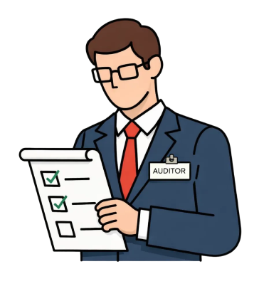

The audit is a review of our QMS documentation and procedures. The auditor will conduct an interview to understand how we work, assess consistency in our processes, and test our understanding of quality initiatives. This isn't meant to be a "gotcha" moment, nor is it about perfection or about making mistakes. The goal is to be honest and transparent.

### Your responsibilities
?[expectations.webm](assets/expectations.webm)

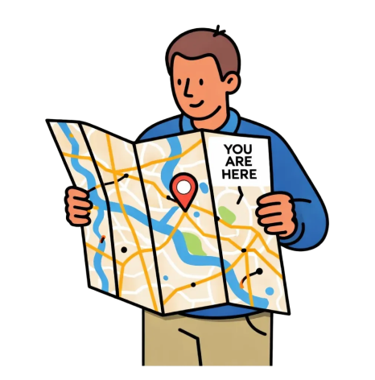

So how does all of this impact you? What are your responsibilities? Simply put, everyone at CivicActions needs to know our Quality Policy and our Quality Objectives, and where to find the QMS in Confluence. You need to understand your role in the process and actively contribute to continual improvement by participating in feedback and training. 

### Certification
?[Roadmap.webm](assets/Roadmap.webm)

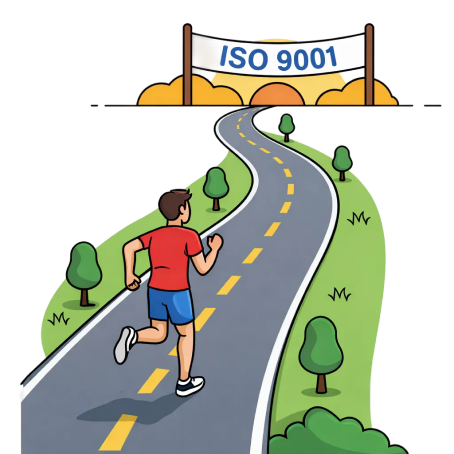

This is our roadmap to certification. We'll finalize objectives and metrics in Q1, followed by an internal audit. After addressing those findings, we'll engage the external auditor for the Stage 1 and Stage 2 audits, aiming to achieve ISO 9001 certification by Q2.

## Checkpoint quiz
?[quizstart.webm](assets/quizstart.webm)

Let's take a moment to review what we've covered so far. Select the correct answer or answers for the next few questions

### 7. Who's responsible for quality at CivicActions?
- [( )] Compliance
- [( )] Leadership
- [( )] Delivery teams
- [(X)] Everyone

### 8. What needs to happen before we get ISO certified? 
Select all that apply
- [[ ]] All quality objectives metrics are at 100%
- [[X]] Implement quality objectives
- [[ ]] Define processes even if there are no metrics or goals
- [[X]] Conduct an internal audit
- [[X]] Fix all findings found in the external audit

## Summary
?[Summary.webm](assets/Summary.webm)

ISO 9001 aligns with how we already work and reflects our core values. Take the lead in building this culture of quality. Continuous improvement will drive our intentional growth. And remember: Quality is everyone's responsibility. Thank you for your participation in our quality objectives!
